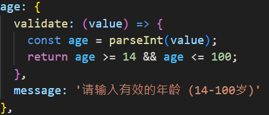
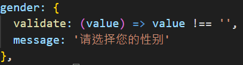
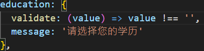
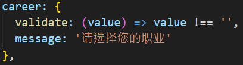
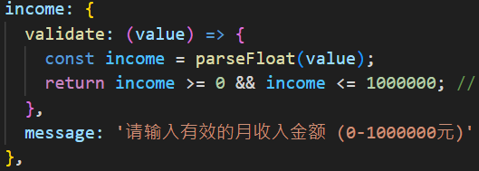
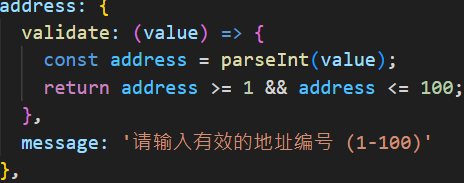

# FairyRecom - 视频推荐系统

基于多种算法的智能视频推荐系统，支持协同过滤、内容推荐、混合推荐等多种策略。

## 📁 项目结构

```
FairyRecom/
├── src/fairyrecom/                   # 主要源代码包
│   ├── core/                         # 核心推荐算法
│   │   ├── recommendation_engine.py  # 推荐引擎
│   │   ├── affinity_analyzer.py      # 亲和度分析器
│   │   └── affinity_simple.py        # 简化版分析器
│   ├── api/                          # API接口
│   │   └── recommendation_api.py     # Flask API服务
├── docs/                             # 文档
├── static/                           # 静态资源
│   ├── web_demo.html                 # Web演示界面
│   └── *.png                         # 图表文件
├── data.db                           # 数据库文件
├── requirements.txt                  # 依赖包
├── setup.py                          # 安装脚本
├── app.py                            # API启动脚本
└── run_web_demo.py                   # Web演示启动脚本
```

## 🚀 快速开始

### 1. 安装依赖

```bash
pip install -r requirements.txt
```

### 2. 启动API服务

```bash
python run_api.py
```

API服务将在 `http://localhost:5000` 启动

### 2.1 下载TextBlob语料库

```bash
python -m textblob.download_corpora
```

### 3. 启动Web演示

```bash
python run_web_demo.py
```

Web演示界面将在 `http://localhost:8080/static/web_demo.html` 启动

### API接口

- `GET /health` - 健康检查
- `GET /recommend/<user_id>` - 获取用户推荐
- `POST /recommend/batch` - 批量推荐
- `GET /similar/users/<user_id>` - 相似用户查找
- `GET /similar/videos/<video_id>` - 相似视频查找
- `GET /explain/<user_id>/<video_id>` - 推荐解释
- `GET /stats/user/<user_id>` - 用户统计
- `GET /stats/video/<video_id>` - 视频统计
- `GET /stats/system` - 系统统计

### 核心功能

- **多算法支持**: 协同过滤、内容推荐、混合推荐、流行度推荐
- **智能解释**: 提供推荐理由和解释
- **相似性分析**: 用户和视频相似度计算
- **统计分析**: 全面的数据统计和分析
- **Web界面**: 直观的演示和交互界面

### FairyRecom 如何推荐视频？
> FairyRecom 使用`reasoning dataset`训练视频推荐模型其包含协同过滤、内容推荐、混合推荐、流行度推荐、冷启动推荐等推荐模式

*FairySearch依赖此FairyRecom进行视频推荐等操作*

## 0x1 协同过滤

当 FairySearch 通过POST方式请求`/api/recom_form`API时，FairyRecom通过下列一系列操作完成推荐

1. 获取POST表单数据
```python
age = int(req_data.get('age'))
gender = int(req_data.get('gender'))
education = int(req_data.get('education'))
hobby = list(req_data.get('hobby'))
address = int(req_data.get('address'))
income = float(req_data.get('income'))
career = int(req_data.get('career'))
```
在前端的有效性检验：

| 栏位     | 方框类型   | 检验类型                       | 源码 |
| -------- | ---------- | ------------------------------ | ---- |
| 年龄     | 文字方块   | 完整性检查、范围检查和类型检查 |     |
| 性别     | 下拉式选框 | 完整性檢查                     |     |
| 學歷     | 下拉式选框 | 完整性檢查                     |     |
| 大專     | 下拉式选框 | 完整性檢查                     |     |
| 月收入   | 文字方块   | 完整性检查、范围检查和类型检查 |     |
| 地址編號 | 文字方框   | 完整性检查、范围检查和类型检查 |     |
| 愛好     | 文字方框   | 完整性检查、格式檢查           |     |